# 🤖 RAG Assistant

A modern **Retrieval-Augmented Generation (RAG)** chatbot built with Next.js 16, LangGraph, Pinecone, and Google Gemini. Upload documents to build your knowledge base and chat with AI that answers based on your content.

<div>


</div>

## ✨ Features

- **📄 Document Upload** - Support for PDF, TXT, and DOCX files
- **🧠 Smart RAG Pipeline** - LangGraph-powered workflow with vector similarity search
- **💬 Multi-Conversation Support** - Create, switch, and manage multiple chat sessions
- **🎨 Premium Dark UI** - Sleek glassmorphism design with teal accents
- **⚡ Real-time Streaming** - Smooth typing animation for responses
- **💾 Persistent Storage** - Conversations saved to localStorage

## 🛠️ Tech Stack

| Category | Technology |
|----------|------------|
| **Framework** | Next.js 16 (App Router) |
| **AI/LLM** | Google Gemini 2.5 Flash Lite |
| **Orchestration** | LangGraph |
| **Vector DB** | Pinecone |
| **Storage** | Supabase |
| **Styling** | Tailwind CSS 4 |
| **Components** | Radix UI + Lucide Icons |

## 🚀 Quick Start

### 1. Clone & Install

```bash
git clone https://github.com/Guddu-Pandit/Rag-App.git
cd Rag-App
npm install
```

### 2. Configure Environment

Create a `.env` file in the root directory:

```env
# Supabase
NEXT_PUBLIC_SUPABASE_URL=your_supabase_url
NEXT_PUBLIC_SUPABASE_ANON_KEY=your_supabase_anon_key
SUPABASE_SERVICE_ROLE_KEY=your_supabase_service_role_key
BUCKET_NAME=rag_app

# Pinecone
PINECONE_API_KEY=your_pinecone_api_key
PINECONE_INDEX=rag

# Google Gemini
GEMINI_APT_KEY=your_gemini_api_key

# LangSmith (Optional- For Tracing)
LANGCHAIN_TRACING_V2=true
LANGCHAIN_API_KEY=your_langsmith_api_key
LANGCHAIN_PROJECT=Rag-App
```

### Environment Variables Reference

| Variable | Description |
|----------|-------------|
| `NEXT_PUBLIC_SUPABASE_URL` | Your Supabase project URL |
| `NEXT_PUBLIC_SUPABASE_ANON_KEY` | Supabase anonymous/public key |
| `SUPABASE_SERVICE_ROLE_KEY` | Supabase service role key (for server-side operations) |
| `BUCKET_NAME` | Supabase storage bucket name for documents |
| `PINECONE_API_KEY` | Your Pinecone API key |
| `PINECONE_INDEX` | Pinecone index name for vector storage |
| `GEMINI_API_KEY` | Google Gemini API key for LLM and embeddings |
| `LANGCHAIN_TRACING_V2` | Set to `true` to enable LangSmith tracing (optional) |
| `LANGCHAIN_API_KEY` | LangSmith API key for tracing (optional) |
| `LANGCHAIN_PROJECT` | LangSmith project name (optional) |

### 3. Run Development Server

```bash
npm run dev
```

Open [http://localhost:3000](http://localhost:3000) to start chatting!

## 📁 Project Structure

```
ragapp/
├── app/
│   ├── api/
│   │   ├── chat/          # Chat endpoint
│   │   ├── documents/     # Document CRUD
│   │   └── upload/        # File upload handler
│   └── page.tsx           # Main chat interface
├── components/
│   ├── ChatInput.tsx      # Message input
│   ├── ChatMessage.tsx    # Message display
│   ├── ConversationSidebar.tsx
│   └── DocumentUpload.tsx
└── lib/
    ├── embeddings.ts      # Gemini embeddings
    ├── langgraph.ts       # RAG workflow (Hierarchical Tracing)
    ├── pinecone.ts        # Vector DB client
    └── supabase.ts        # Storage client
```

## 🔧 How It Works

```mermaid
graph TD
    A[📄 User Upload] -->|Chunk & Store| B[🗄️ Supabase Storage]
    A -->|Embed| C[⚡ Gemini Embeddings]
    C -->|Vector Index| D[🌲 Pinecone DB]
    E[👤 User Query] -->|Search| D
    D -->|Retrieve Context| F[🧠 LangGraph Workflow]
    F -->|Generate Answer| G[🤖 Gemini AI]
```




1. **📥 Ingestion** → Upload documents (PDF, Docx) which are securely stored in Supabase.
2. **🧩 Processing** → Text is chunked and converted into vector embeddings.
3. **💾 Indexing** → High-dimensional vectors are stored in Pinecone for semantic search.
4. **🔍 Retrieval** → LangGraph orchestrates the search for relevant context.
5. **✨ Generation** → Gemini synthesizes the ANSWER using your specific data.


## 🧠 LangGraph Workflow

The intelligent orchestration layer manages the conversation flow with hierarchical tracing for **LangSmith**:

```mermaid
graph TD
    Start([Start]) --> Agent[🤖 Agent Node]
    subgraph Agent_Internal [Agent:Generate]
        Agent
    end
    
    Agent -->|CallTools| Tool[🔍 Tool Node]
    subgraph Tool_Internal [Tool:VectorSearch]
        Tool
    end
    
    Tool --> Agent
    Agent -->|Finish| End([End])
```



1. **Agent Node (`Agent:Generate`)**: The starting point of the graph. It uses Gemini 2.5 Flash Lite to decide whether to use the vector search tool or provide a final answer.
2. **Conditional Edge**: Routes to `Tool` if the LLM initiates a `PineconeVectorSearch` call, or to `END` if a final response is ready.
3. **Tool Node (`Tool:VectorSearch`)**: Executes the specialized `PineconeVectorSearch` tool to fetch context from the knowledge base.
4. **Loop Management**: After tool execution, the graph loops back to the `Agent` node to incorporate the retrieved context into the final answer.

## 📄 License
This project is licensed under the ISC License.

